# GCP Security Workflows

Reusable GitHub Actions workflows for a minimal GCP-only security scanning pipeline:

1. DEV: Trivy filesystem, secret, and config scan on push and pull request.
2. BUILD: Trivy container image scan after image build and before push.
3. DEPLOY: Prowler scan against live GCP configuration after `terraform apply`.
4. NETWORK: Nmap plus an OpenVAS/GVM integration placeholder on a nightly schedule.

The real workflow logic lives in this central repository. Individual infrastructure
repositories should call these files with GitHub Actions reusable workflows, as shown in
`gcp-infra-repo-example/.github/workflows/trivy-prowler-security.yml`.

## Workflow Diagram

```mermaid
flowchart TD
    caller[Caller infrastructure repository] --> gha[GitHub Actions reusable workflows]

    gha --> dev[DEV: Trivy filesystem scan]
    gha --> kics[KICS: IaC security scan]
    gha --> build[BUILD: Trivy image scan]
    gha --> deploy[DEPLOY: Prowler GCP scan]
    gha --> network[NETWORK: Nmap scan]

    secrets[GitHub secrets and variables] --> gha
    secrets --> wif[WIF_PROVIDER]
    secrets --> uploader[RESULTS_UPLOADER_SA]
    secrets --> prowler_sa[PROWLER_SA]
    secrets --> bucket_input[RESULTS_BUCKET]
    secrets --> project_input[GCP_PROJECT_ID]
    secrets --> targets_input[SCAN_TARGET_CIDR]

    dev --> dev_out[dev-results: JSON, SARIF, HTML]
    kics --> kics_out[kics-results: JSON, SARIF, HTML]
    build --> build_out[build-results: JSON, SARIF, HTML]
    deploy --> deploy_out[prowler-results: JSON-OCSF, HTML, CSV]
    network --> network_out[nmap-results: XML, text]

    dev_out --> artifacts[GitHub artifacts]
    kics_out --> artifacts
    build_out --> artifacts
    deploy_out --> artifacts
    network_out --> artifacts

    dev_out --> code_scanning[GitHub code scanning]
    kics_out --> code_scanning
    build_out --> code_scanning

    gha --> auth[google-github-actions/auth with Workload Identity Federation]
    auth --> gcloud[google-github-actions/setup-gcloud]
    gcloud --> gcs[GCS results bucket]

    dev_out --> dev_gcs[gs://bucket/year=YYYY/month=MM/day=DD/tool=trivy_fs/run_id=RUN_ID/]
    kics_out --> kics_gcs[gs://bucket/year=YYYY/month=MM/day=DD/tool=kics/run_id=RUN_ID/]
    build_out --> build_gcs[gs://bucket/year=YYYY/month=MM/day=DD/tool=trivy_image/run_id=RUN_ID/]
    deploy_out --> deploy_gcs[gs://bucket/year=YYYY/month=MM/day=DD/tool=prowler/run_id=RUN_ID/]
    network_out --> network_gcs[gs://bucket/year=YYYY/month=MM/day=DD/tool=nmap/run_id=RUN_ID/]

    dev_gcs --> gcs
    kics_gcs --> gcs
    build_gcs --> gcs
    deploy_gcs --> gcs
    network_gcs --> gcs
```

## Required Configuration

| Name | Type | Used by | Purpose |
| --- | --- | --- | --- |
| `WIF_PROVIDER` | Secret | all reusable workflows | Full GCP Workload Identity Provider resource name used by `google-github-actions/auth`. |
| `RESULTS_UPLOADER_SA` | Secret | all reusable workflows | Narrowly scoped service account used to upload scan output to GCS. Grant it `roles/storage.objectCreator` on the results bucket. |
| `PROWLER_SA` | Secret | `prowler-deploy-gcp-scan.yml` | GCP service account email that Prowler impersonates to scan live project configuration. |
| `GCP_PROJECT_ID` | Repository variable | caller deploy job | Project ID passed to the reusable deploy scan after Terraform succeeds. |
| `RESULTS_BUCKET` | Repository variable | all reusable workflows | GCS bucket name passed as the required `results_bucket` input for durable scan result storage. |
| `SCAN_TARGET_CIDR` | Repository variable | caller network job | CIDR range or target list used by the nightly network scan. |

Use Workload Identity Federation only. Do not create or store static GCP JSON service
account keys for these workflows.

Each reusable workflow requires a `results_bucket` input. Results are uploaded with
`gcloud storage cp -r` into Hive-partitioned prefixes:

| Workflow | GCS prefix |
| --- | --- |
| `trivy-dev-filesystem-scan.yml` | `gs://<results_bucket>/year=YYYY/month=MM/day=DD/tool=trivy_fs/run_id=<run_id>/` |
| `kics-iac-scan.yml` | `gs://<results_bucket>/year=YYYY/month=MM/day=DD/tool=kics/run_id=<run_id>/` |
| `trivy-build-image-scan.yml` | `gs://<results_bucket>/year=YYYY/month=MM/day=DD/tool=trivy_image/run_id=<run_id>/` |
| `prowler-deploy-gcp-scan.yml` | `gs://<results_bucket>/year=YYYY/month=MM/day=DD/tool=prowler/run_id=<run_id>/` |
| `nmap-network-scan.yml` | `gs://<results_bucket>/year=YYYY/month=MM/day=DD/tool=nmap/run_id=<run_id>/` |

Create the results bucket before using these workflows. Recommended bucket settings:
uniform bucket-level access, public access prevention, object versioning, and a lifecycle
rule such as 365-day expiration. Scan output can reveal vulnerabilities, secrets,
reachable services, and cloud misconfigurations, so treat the bucket as sensitive.

## Workflow Notes

`trivy-dev-filesystem-scan.yml` blocks on Trivy findings because it runs before code is merged. This is the
lowest-cost place to fix dependency, secret, and IaC configuration issues.

`kics-iac-scan.yml` scans Infrastructure as Code for misconfigurations before deployment.
It uploads JSON, SARIF, and HTML as artifacts, publishes SARIF to GitHub code scanning,
and copies the reports into GCS under the `tool=kics` partition.

`trivy-build-image-scan.yml` scans the built container image and blocks only on `CRITICAL` and `HIGH`
findings. It uploads JSON, SARIF, and HTML as artifacts, publishes SARIF to GitHub code
scanning, and copies the reports into GCS for longer-term retention.

`prowler-deploy-gcp-scan.yml` authenticates to GCP through GitHub OIDC and Workload Identity Federation,
then runs `prowler gcp --project-ids <project_id>`. Prowler findings do not fail the job
because the infrastructure is already live after `terraform apply`; the workflow uploads
JSON-OCSF, HTML, and CSV artifacts for alerting and follow-up, then copies the same output
directory to GCS.

`nmap-network-scan.yml` is designed for scheduled execution only from caller repositories. It
runs Nmap with service detection and uploads XML plus standard text output both as a
GitHub artifact and to GCS.
